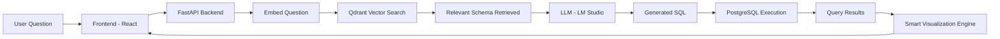

# InsightFusion AI 🧠📊  
### LLM-Powered SQL RAG Analytics Engine


---

## 🚀 Overview

InsightFusion AI is an end-to-end AI-powered data analytics system that allows users to query databases using natural language.

It combines:

- 🧠 LLM-powered SQL generation  
- 🔎 Vector-based schema retrieval (RAG)  
- 🐘 PostgreSQL execution  
- 📊 Dynamic visualization (charts + KPI detection)  

Instead of hardcoding schema into prompts, this system retrieves relevant schema context using Qdrant, making it scalable and production-ready.

---

## 🧠 Architecture



---

## 🛠 Tech Stack

### Backend
- FastAPI
- PostgreSQL
- SQLAlchemy
- Qdrant (Vector Database)
- Sentence Transformers
- LM Studio (Local LLM)

### Frontend
- React (Vite)
- TypeScript
- Recharts
- Axios

### Infrastructure
- Docker
- Dockerized PostgreSQL
- Dockerized Qdrant

---

## ✨ Features

- Natural language → SQL conversion  
- Retrieval-Augmented Generation (Schema RAG)  
- Dynamic schema search using embeddings  
- Safe SELECT-only SQL generation  
- KPI auto-detection  
- Smart chart detection (Bar / Line)  
- Date recognition  
- Clean chat-based UI  
- Fully local & privacy-safe  

---

## 📊 Smart Visualization Logic

The frontend automatically detects:

- Single numeric value → KPI card  
- Date + numeric → Line chart  
- Category + numeric → Bar chart  
- Otherwise → Table view  

---

## ⚙️ How To Run Locally

### 1️⃣ Clone Repository

```bash
git clone https://github.com/YOUR_USERNAME/insightfusion-ai.git
cd insightfusion-ai
```

---

### 2️⃣ Start PostgreSQL & Qdrant

```bash
docker run -d --name postgres -p 5432:5432 postgres:15
docker run -d --name qdrant -p 6333:6333 qdrant/qdrant
```

---

### 3️⃣ Backend Setup

```bash
cd backend
python -m venv venv
venv\Scripts\activate
pip install -r requirements.txt
python app/schema_indexer.py
uvicorn app.main:app --reload
```

---

### 4️⃣ Frontend Setup

```bash
cd frontend
npm install
npm run dev
```

Open:

http://localhost:5173

---

## 🔎 Example Questions

- Show all orders  
- What is total sales?  
- Show total sales per product  
- Which product generated the highest revenue?  
- Show revenue by month  

---

## 📈 Future Improvements

- Role-based query restrictions  
- Auto dashboard mode  
- Query explanation mode  
- Streaming SQL generation  
- Column-level semantic retrieval  
- Multi-database support  
- Cloud deployment  

---

## 🧠 Why This Project Matters

Most SQL chatbots hardcode schema into prompts.

InsightFusion AI uses Retrieval-Augmented Generation for database schema understanding.

This makes it scalable to large, real-world databases.

---

## 📜 License

MIT License

---

## 👩‍💻 Author

Francis
